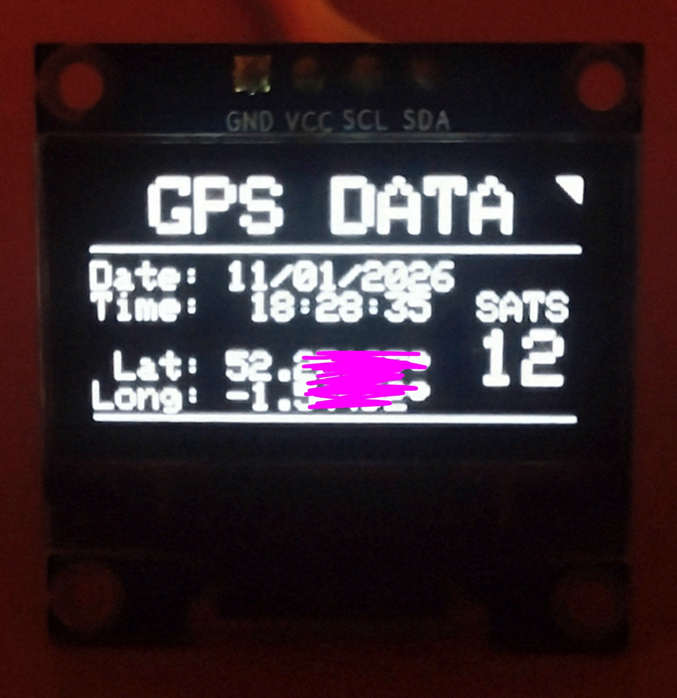

# Arduino R4 GPS Data Parsing
An Interrupt Driven NEO-6M GPS Parser for Arduino Nano R4 and Uno R4.

A high-performance, interrupt-driven NMEA sentence parser specifically optimized for the **Arduino Nano R4 or Uno R4 (Minima or WiFi)**. This project leverages the Renesas RA4M1 hardware timers to ensure zero data loss from the GPS module, even during heavy OLED refresh cycles. Contrast this with the more traditional (and often blocking) "SoftwareSerial" approach used in R3 solutions, that do not have the R4's additional hardware capabilities, were GPS data can be lost during heavy OLED refresh cycles.

| Up and Running! | Look at the Data! |
| :---: | :---: |
|  |  |

## Warnings!
* As I was working on this script, improving the logic around the GPS module cold starting and fixing some typos, v1.5.2 of the **Arduino Uno R4** board package was released. Of course, I upgraded from v1.5.1 to this new version, but then the script stopped working, or specifically the OLED display stopped working. The script compiles perfectly and downloads without issue, but it seems that something in the board package update breaks something (a something that is I2C related, I think) and despite a lot of experimenting with suggested workarounds and I2C timeout values, only downgrading back to v1.5.1 fixed the OLED display issue.
* If your OLED display does not seem to be responding, use the Arduino I2C Scanner sketch to check the I2C address and that the OLED is on the I2C bus. If it is not found on the I2C bus at all, check that the SDA and SCL lines both have pull-up resistors.

## Key Features
* **Hardware Interrupts:** Uses 'FspTimer' to sample 'Serial1' at 1kHz, placing the raw GPS data in a robust circular buffer.
* **Flashing On-Board LED:** This is an indicator that the hardware interrupt is running.
* **Timezone Aware:** Includes logic for UTC to Local Time conversion, including complex date/month/year rollovers, but years are assumed to be in the range 2000 - 2099.
* **High Precision:** Utilizes 64-bit 'double' types for Latitude and Longitude to maintain high calculation accuracy.
* **Smart UI:** Features a "Heartbeat" indicator and diagnostic screens to distinguish between wiring issues ("NO DATA") and satellite acquisition ("NO SIGNAL").
* **GPS Cold Start Detection:** Recognises the date 3"1/12/99" as the "I do not yet have the full almanic" date when the GPS module has not got a full fix, typically after a cold start, and displays the date as "--/--/----" during this period.
* **Efficient Parsing:** Uses standard C-string libraries and 'strcmp' for a lean memory footprint.
* **Heartbeat Monitor:** Visual corner "triangle" indicator flags toggle on the OLED every second to prove the code is alive and processing.
* **Dual-State Error Handling:**
    * **NO SIGNAL:** The GPS is communicating, but hasn't locked onto enough satellites yet.
    * **NO DATA:** The GPS hardware is disconnected or the serial stream has stopped.
* **Checksum Validation:** Every NMEA sentence is XOR-verified before parsing to prevent garbled or incorrect data from being displayed.

## Why This Sketch is "Robust"
Most GPS sketches use the 'TinyGPS' library with 'SoftwareSerial'. While great at first, these scripts often "stutter" (mine certainly did) or drop data (again, mine certainly did) when the processor is busy updating a display, or doing other things in loop().

This project is built differently:

* **1kHz Hardware Timer Interrupts:** Uses the Nano R4's Renesas-specific 'FspTimer' to poll the UART buffer every 1ms. This ensures the GPS data is captured instantly, regardless of what the main 'loop()' is doing.
* **Circular Data Buffer:** Implements a 'volatile' circular buffer to safely pass data between the Interrupt Service Routine (ISR) and the main program logic.
* **Double Data Buffering:** The raw GPS data is read from the circular buffer into another buffer for parsing and processing.
* **Manual NMEA Parsing:** Instead of a heavy library, it uses a custom, lightweight parser utilizing 'strtok', 'strchr', and pointer arithmetic. This provides absolute control over memory and speed.
* **Robust Timezone Engine:** Includes a signed-integer math engine to handle timezone offsets, including day, month, and year rollovers (and even leap years).
* **Non-Flicker OLED UI:** Updates the SSD1306 display only when the data changes to prevent the "flashing" associated with frequent screen clearing.
* **Faster I2C Clock:** The faster I2C clock speed of 400KHz is used, instead of the default 100KHz, for updating the OLED display.

## Hardware Requirements
1.  **Arduino** **Nano R4** or **Uno R4** (Minima or WiFi).
2.  **NEO-6M** GPS Module (or similar NMEA-compliant module).
3.  **SSD1306** 128x64 0.96" or 64x48 0.66" I2C OLED display.
4.  **Breadboard** or breakout board and jumper wires.

## Wiring Diagram

| Component | Arduino R4 Pin | Notes |
| :--- | :--- | :--- |
| **GPS VCC** | 5V or 3.3V | Check your specific module's voltage. |
| **GPS RX** | D1 (TX) | Connects to Arduino TX. |
| **GPS TX** | D0 (RX) | Connects to Arduino RX. |
| **GPS GND** | GND | Common Ground. |
| **OLED GND** | GND | Common Ground. |
| **OLED VCC** | 5V or 3.3V | Check your specific module's voltage. |
| **OLED SCL** | A5 / SCL | Connects to Arduino I2C clock. |
| **OLED SDA** | A4 / SDA | Connects to Arduino I2C data. |

> **Note:** Because this sketch uses 'Serial1' for the GPS hardware UART, the primary 'Serial' (USB) remains free for debugging at **115200 Baud**.

## Software Setup
1.  Install the following libraries via the Arduino Library Manager:
    * 'Adafruit GFX Library'
    * 'Adafruit SSD1306'
2.  Open the 'GPS_NEO6M_Parse_R4_FSP.ino' file in the Arduino IDE.
3.  Select **Tools > Board > Arduino Renesas Mode Boards > Arduino Nano R4**.
4.  Adjust the 'TZOFFSET' constant in the code to match your local timezone offset.
5.	Adjust the 'GPSBAUD' constant if your NMEA compliant module does not use 9600 baud.
6.  Upload the sketch.

## Usage Tips
* **Cold Start:** If the GPS module hasn't been powered on recently, it may take 30–60 seconds to acquire a signal. 
* **Antenna:** The ceramic patch antenna must face **up** toward the sky for reliable tracking.
* **Blinking LED:** The NEO-6M typically has an onboard LED that blinks once per second only when a valid position fix is active.
* **Debugging:** If you are having trouble parsing, uncomment '#define DEBUG' at the top of the code to see raw NMEA data in the Serial Monitor.

## How It Works: Under the Hood
The sketch is architected to prioritize data integrity and UI responsiveness by separating data acquisition from data processing.

### 1. Background Data Acquisition (The ISR)
Unlike standard sketches that "wait" for serial data, this project uses the **R4 Renesas FspTimer**.
* **1000Hz Polling:** A hardware timer triggers the 'gpsDataReadISR' function every 1ms.
* **Circular Buffer:** Incoming bytes are immediately placed into a 'volatile char gpsDataBuffer[512]'. 
* **Zero Latency:** Because this happens in the background, the GPS data stream is captured even while the OLED is performing slow I2C write operations.

### 2. Sentence Validation (The Gatekeeper)
The 'getSentence()' function acts as a filter for the raw data stream:
* **Frame Detection:** It searches for the NMEA start symbol ('$') and then looks for the carriage return/line feed termination.
* **Checksum Verification:** NMEA sentences include a HEX checksum after the '*' character. The code recalculates the XOR checksum of the received data and compares it to the transmitted one. If they don't match (due to electrical noise or loose wires), the sentence is discarded.

### 3. Field-Level Parsing (Pointer Arithmetic)
Instead of using heavy string-manipulation libraries, 'parseSentence()' uses high-speed C-string functions:
* **Tokenizing:** Uses 'strchr' to find commas and replaces them with null-terminators ('\0'). This "slices" the sentence into readable fields without moving them in memory.
* **Extraction:**
	* **GPRMC:** Extracted for Time, Date, Validity, and Coordinates.
    * **GPGGA:** Extracted specifically for the Satellite count.
* **Pointer Safety:** The parser carefully advances pointers only when valid delimiters are found, preventing memory "overshoot" or crashes.

### 4. The Timezone & Rollover Engine
Since GPS provides Time/Date in UTC, the code applies a 'TZOFFSET'. To ensure this doesn't break at midnight or month-ends:
* **Signed Math:** Calculations are performed with signed integers to handle negative hour results (e.g., UTC 00:00 - 5 hours).
* **Calendar Logic:** If the hour rolls over, the code automatically increments or decrements the Day, Month, and Year, with full support for Leap Years in this century.

### 5. Smart OLED Refresh
The 'displayGPSDateTime()' function manages the "User Experience":
* **Differential Updates:** It compares the current GPS second to the previous one. The display is only refreshed when the time actually changes (once per second).
* **Simple Heartbeat Indicator:** Small flags alternately blink in the upper corners of the display, confirming that the data and display are updating.
* **State Logic:** It manages the transition between the active data view and the "NO SIGNAL" / "NO DATA" warning boxes based on the 'gpsValid' flag and the 'lastFixMillis' timer.

## Use and Abuse
This code was designed to be resilient. Feel free to flood the buffer or unplug the GPS mid-stream; the error handling and circular buffer are designed to recover gracefully.

## ToDo
Is there anything? Let me know if you find a problem or think of any improvements!

## References 
These were very helpful:
 * https://www.rfwireless-world.com/terminology/gps-nmea-sentences
 * https://www.best-microcontroller-projects.com/arduino-strtok.html

And the **GOTO** Guide for Markdown Syntax:
* https://www.markdownguide.org/cheat-sheet/

*Enjoy!*

// EOF
